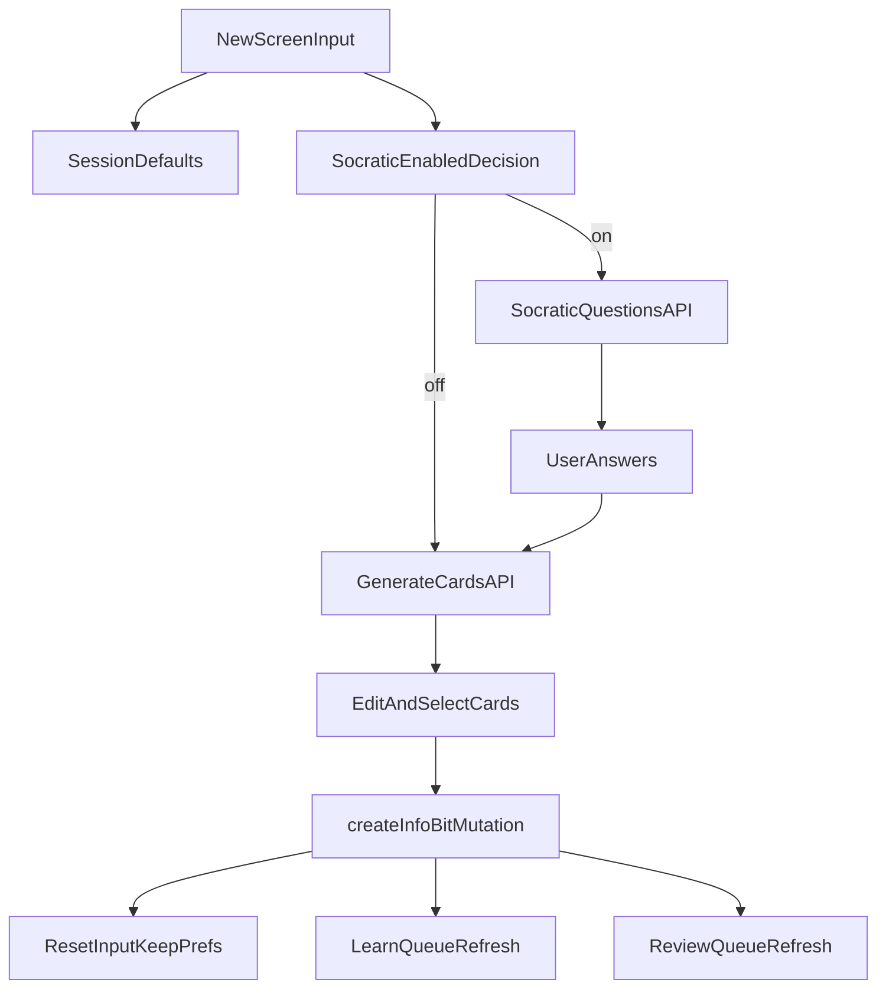

# Sticky Frontend V2 — Technical Specification

Last updated: 2026-03-01
Status: Approved for implementation

---

## 0. Goals

Build a modular V2 frontend that:

1. Opens on `New` capture flow by default.
2. Integrates LLM Socratic + card generation through a local proxy layer.
3. Supports `Learn`, `Review`, and `My Cards` as primary destinations.
4. Preserves the existing isolated FSRS playground/testing environment.

This spec extends and does not replace:

- `docs/FRONTEND_API_SPEC.md`
- `docs/FSRS_REFERENCE.md`
- `docs/API_ACTION_CATALOG.md`

---

## 1. Route and Navigation Model

## Primary Authenticated Routes

- `/new` (default landing route)
- `/learn`
- `/review`
- `/my-cards`
- `/settings`
- `/profile` (if split from settings)
- `/playground` (dev/test, isolated)

## Route Redirect Rules

- `/` -> `/new`
- unauthenticated users -> `/login`

---

## 2. Feature Modules

Create/extend modules under `src/features/`:

- `new/`
  - `NewPage.tsx`
  - `useSessionDefaults.ts`
  - `useSocraticFlow.ts`
  - `useGeneratedCards.ts`
  - `components/` (`CaptureCard`, `GeneratedCardCarousel`, `SocraticQuestionPanel`)
- `learn/`
  - `LearnPage.tsx`
  - `useLearnQueue.ts`
- `review/` (existing, upgraded)
  - `ReviewPageV2.tsx` or update existing `ReviewPage.tsx`
  - rating helper preview renderer
- `my-cards/`
  - `MyCardsPage.tsx`
  - `FlaggedCardsPanel.tsx`
  - `CardEditorDrawer.tsx`
- `playground/` keep isolated

Cross-feature shared modules:

- `src/components/navigation/BottomPrimaryNav.tsx`
- `src/components/layout/AppFrame.tsx`
- `src/lib/session/preferences.ts`
- `src/lib/llm/client.ts`
- `src/lib/llm/types.ts`

---

## 3. LLM Local Proxy Architecture

## Requirement

Browser must never send OpenAI API key directly.

## Implementation Strategy

- Add local server-side proxy in this repo (dev runtime).
- Frontend calls local endpoints only.
- API key read from server-side env var (`OPENAI_API_KEY`).

## Proxy Endpoints (frontend-local)

- `POST /api/llm/socratic-questions`
  - Input: `{ inputText, category, tags, priorAnswers? }`
  - Output: `{ questions: [{ id, text, options?: string[] }] }`
- `POST /api/llm/generate-cards`
  - Input: `{ inputText, category, tags, socraticEnabled, qaContext }`
  - Output: `{ cards: [{ front, back, rationale?, selectedByDefault }] }`

## Generation Rules

- Target 4 cards by default.
- Allow discretionary fewer cards when content is narrow/simple.
- Enforce JSON output schema with validation + fallback parser.

---

## 4. Data Flow

---

## 5. Session Defaults Logic

Implement deterministic utility:

- `isSingleWord(inputText)`:
  - true when trimmed input token count = 1 and no sentence delimiters.
- startup defaults:
  - `category = New Word`
  - `socraticEnabled = localStorage(last value) || false`
  - `tags = []`
- post-submit within same app session:
  - keep last submitted category/tags/socratic setting

Storage split:

- localStorage:
  - socratic toggle preference
- sessionStorage:
  - current-session category and tags defaults

---

## 6. Learn and Review State Handling (Current Backend)

V2 route behavior requires explicit queue partitioning:

- `/learn` -> `DueQueueKind.LEARN`
- `/review` -> `DueQueueKind.REVIEW`
- app-level due chips/indicators -> `DueQueueKind.ALL`

Required API contract:

- `dueQueue(kind: DueQueueKind!, limit: Int)` with `fsrsState`, `reps`, and `lapses`.
- `DueQueueKind = LEARN | REVIEW | ALL`.
- `dueInfoBits` remains backward-compatible but is no longer the source of truth for Learn/Review separation.
- Full backend contract details are defined in `BACKEND_CHANGE_SPEC_V2.md`.

## 6.1 Daily Rhythm Heatmap Contract

The `New` route uses a GitHub-style consistency heatmap fed by backend daily engagement data.

Required API:

- `dailyEngagement(windowDays: Int)` returning per-day:
  - `date`
  - `addedCount`
  - `learnedCount`
  - `reviewedCount`
  - `totalCount`

Frontend behavior:

- render the last 12 months as a 7xN contribution grid
- map higher `totalCount` values to deeper green intensity
- keep day bucketing UTC-consistent with backend values

---

## 7. Rating Buttons "Next Review In ..." (Frontend Behavior)

UI requirement:

- under each rating button, show projected delay before user taps.

V2 implementation approach:

- if server preview API exists, use exact values from backend.
- otherwise, compute temporary estimate from local `ts-fsrs` simulation where possible and mark as "estimated".

Formatting helper:

- `< 1 hour`: minutes
- `< 48 hours`: hours
- otherwise: days

---

## 8. Reusable Components

Required reusable components:

- `ContentCard` (elevated surface style)
- `RatingButtonGroup` (used in Learn + Review)
- `InlineEditableCard` (used in New + My Cards)
- `FlagBadge` + `FlagActionMenu`
- `PageTransitionContainer`
- `BottomPrimaryNav`

---

## 9. Animation and Visual System

Use minimal-code library features:

- Mantine transitions for modal/panel/card actions.
- Optional framer-motion for route transitions and draggable carousel.

Constraints:

- keep interactions under 250ms
- avoid heavy animation dependencies beyond practical need

---

## 10. Testing Strategy

## Unit

- input classification (`isSingleWord`)
- session defaults/persistence behavior
- rating preview formatter

## Integration

- New -> Generate -> Submit flow with mocked proxy
- Learn/Review rating loop state updates
- My Cards flag/edit actions

## Manual E2E

- capture with Socratic on/off
- create + review path
- regression check for infobit duplication
- playground remains operational and isolated

---

## 11. Security and Ops Notes

- API keys only in server-side env vars.
- Do not persist raw prompts with secrets.
- Add error boundary around LLM proxy calls.
- If any key was shared in chat/text logs, rotate immediately.

---

## 12. Migration Notes from Current Frontend

1. Keep existing GraphQL hooks where possible.
2. Replace dashboard-first IA with New-first IA.
3. Keep old pages available during migration only if needed behind routes.
4. Preserve `/playground` route behavior and isolation.

